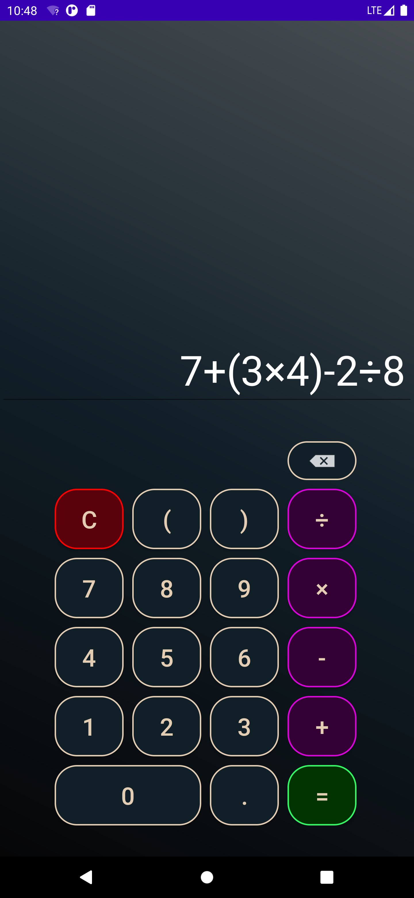

# ScientificCalculator

## Overview:
The ScientificCalculator app is designed for users who need a powerful yet intuitive tool for performing both basic and advanced mathematical calculations. Whether you're tackling everyday arithmetic or delving into complex scientific equations, this app provides the functionality you need, all wrapped in an elegant and user-friendly interface.

## Features:
- **Basic Calculations:** Perform standard arithmetic operations with ease.
- **Advanced Functions:** Access a range of scientific functions including trigonometric operations, logarithms, exponents, square roots, and more.
- **Customizable Colors:** Enjoy a visually appealing interface with a color scheme designed to be easy on the eyes while adding a touch of style.
- **User-Friendly Interface:** Large buttons and a clear display make it easy to input and review calculations.
- **Prime Number Check:** A unique feature allows users to quickly verify whether a number is prime.

## Screenshots:

**Basic Features:**

**Advanced Features:**

